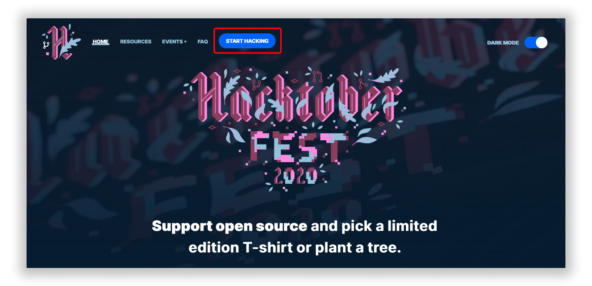
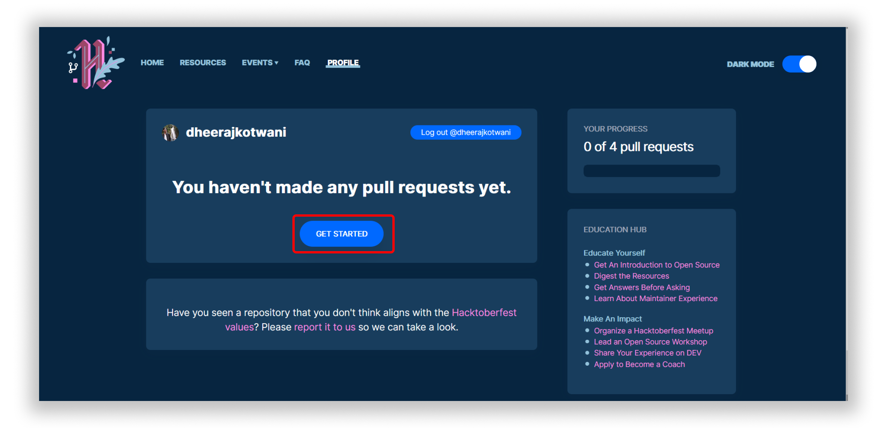
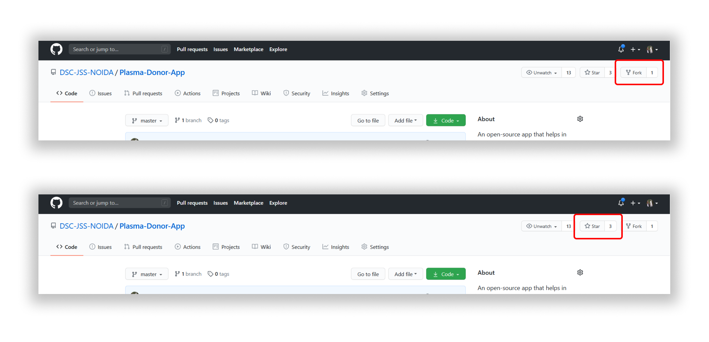
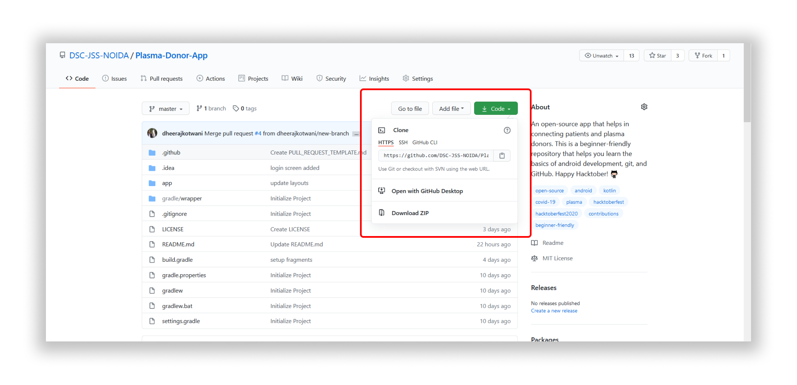
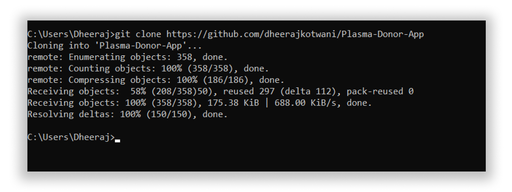
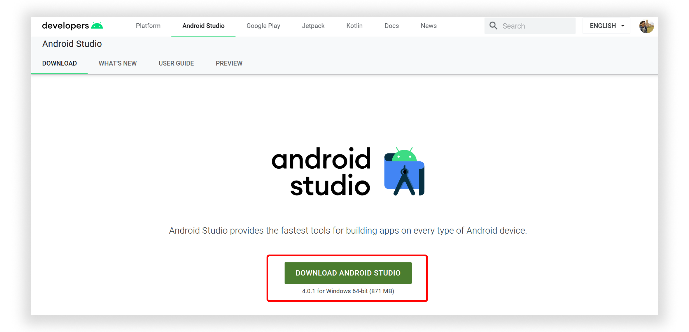
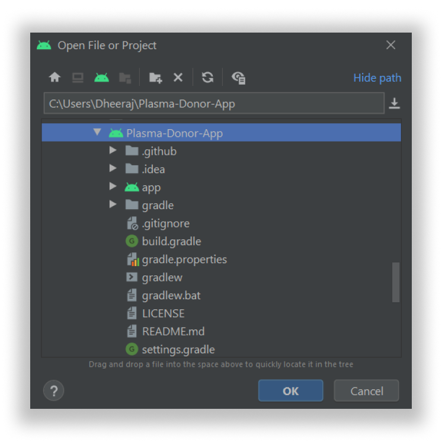
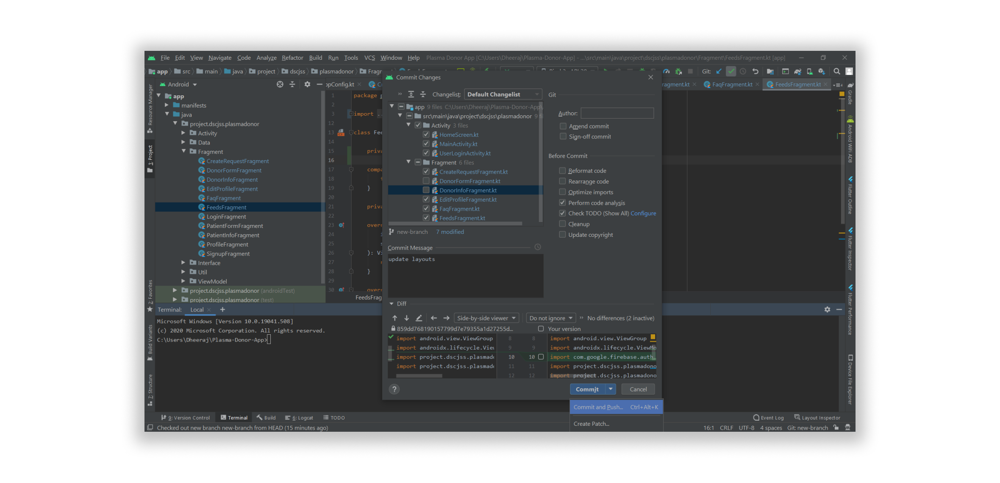
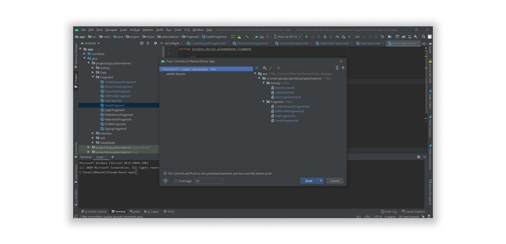
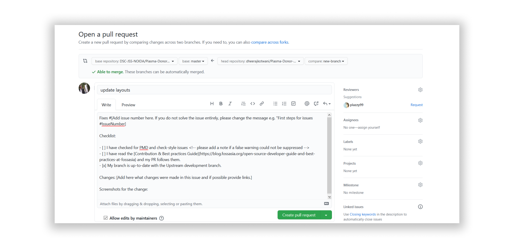

<div align="center"> </div>

# Plasma Donor App
#### An Open Source App which fills the gap between the patients and the Plasma Donors. Beginner Friendly Repository made for Open Source Enthusiast who can contribute to the App during HacktoberFest 2020.
[](https://github.com/DSC-JSS-NOIDA/Plasma-Donor-App/blob/master/LICENSE)


[](https://sourcerer.io/fame/PragatiVerma18/DSC-JSS-NOIDA/Plasma-Donor-App/links/0)[](https://sourcerer.io/fame/PragatiVerma18/DSC-JSS-NOIDA/Plasma-Donor-App/links/1)[](https://sourcerer.io/fame/PragatiVerma18/DSC-JSS-NOIDA/Plasma-Donor-App/links/2)[](https://sourcerer.io/fame/PragatiVerma18/DSC-JSS-NOIDA/Plasma-Donor-App/links/3)[](https://sourcerer.io/fame/PragatiVerma18/DSC-JSS-NOIDA/Plasma-Donor-App/links/4)[](https://sourcerer.io/fame/PragatiVerma18/DSC-JSS-NOIDA/Plasma-Donor-App/links/5)[](https://sourcerer.io/fame/PragatiVerma18/DSC-JSS-NOIDA/Plasma-Donor-App/links/6)[](https://sourcerer.io/fame/PragatiVerma18/DSC-JSS-NOIDA/Plasma-Donor-App/links/7)

Table of Contents
=================

   * [Features](#features)
   * [Tech Used](#tech-used)
   * [Requirements](#requirements)
   * [Slack Channel](#slack-channel)
   * [Getting Started](#getting-started)
      * [1. Register yourself to Hacktoberfest 2020](#1-register-yourself-to-hacktoberfest-2020)
      * [2. Get Started to start contributing](#2-get-started-to-start-contributing)
      * [3. Star and Fork this Repository](#3-star-and-fork-this-repository)
      * [4. Clone the Repository](#4-clone-the-repository)
      * [5. Download Android Studio](#5-download-android-studio)
      * [6. Open the Project](#6-open-the-project)
      * [7. Create New Branch](#7-create-new-branch)
      * [8. Commit and Push](#8-commit-and-push)
      * [9. Update Local Repository](#9-update-local-repository)
      * [10. Configure a Remote for the Fork](#10-configure-a-remote-for-the-fork)
      * [11. Sync the Fork](#11-sync-the-fork)
      * [12. Create Pull Request](#12-create-pull-request)
   * [Check your Hacktoberfest Contribution status](#check-your-hacktoberfest-contribution-status-at)
   * [Connect with us](#connect-with-us)

## Features
- User can add Donors.
- User can Add Patients.
- User can search specifically for Donors.
- User can search specifically for Patients.
- User can add Edit Profile.
- User can see nearby donors/patients in Radar.
- FAQs section to get all details regarding Plasma.

## Tech Used
- Android
- Kotlin
- Firebase
- Figma

## Requirements
- Android Version 5.0 and Above.
- Min sdk 21

## Slack Channel
[](https://join.slack.com/t/dschackfest2020/shared_invite/zt-hvmr02i9-kApLVOuvUHIolKwBbk4Vsg)


## Getting Started
### 1. Register yourself to Hacktoberfest 2020
###### Link to register: https://hacktoberfest.digitalocean.com/


### 2. Get Started to start contributing


### 3. Star and Fork this Repository
###### You can star ⭐ and fork 🍽️ this repository on GitHub by navigating at the top of this repository.

###### GitHub repository URLs will reference both the username associated with the owner of the repository, as well as the repository name. For example, DSC-JSS-NOIDA is the owner of this repository, so the GitHub URL for this project is:

https://github.com/DSC-JSS-NOIDA/Plasma-Donor-App

###### When you’re on the main page for the repository, you’ll see a button to "Star" and “Fork” the repository on your upper right-hand side of the page, underneath your user icon.

### 4. Clone the Repository
###### To make your local copy of the repository you would like to contribute to, let’s first open up a terminal window. 
###### We’ll use the git clone command along with the URL that points to your fork of the repository.
###### This URL will be similar to the URL above, except now it will end with .git. In the example above, the URL will look like this:

https://github.com/your-username/Plasma-Donor-App.git

###### You can alternatively copy the URL by using the green “Clone or download” button from your repository page that you just forked from the original repository page. Once you click the button, you’ll be able to copy the URL by clicking the binder button next to the URL:


###### Once we have the URL, we’re ready to clone the repository. To do this, we’ll combine the git clone command with the repository URL from the command line in a terminal window:
```
git clone https://github.com/your-username/Plasma-Donor-App.git
```


### 5. Download Android Studio
###### Link to Developers page: https://developer.android.com/studio


### 6. Open the Project
###### After completing the setup for Android Studio open the project.


### 7. Create New Branch
###### Once the project is opened create a new branch and checkout in it where you can make the changes in the code.
###### You can do this either from terminal or Directly in Android Studio.
###### To do from Terminal:
```
git branch new-branch
git checkout new-branch
```
###### To do directly from Android Studio
###### Click on Git branch in the bottom-right corner in Android Studio and create a new branch from there and checkout to it.


### 8. Commit and Push
###### After making the required changes commit and push your code
###### Terminal:
###### To add the changes after you have made the modifications
``` git add . ``` or ``` git add -A ```
###### To commit and push the changes
```
git commit -m <Your-commit-message>
```
```
git push --set-upstream origin new-branch
```
###### From Android Studio:



### 9. Update Local Repository
###### While working on a project alongside other contributors, you need to keep your local repository up-to-date with the project as you don’t want to make a pull request for code that will cause conflicts. To keep your local copy of the codebase updated, you’ll need to sync changes.
###### We’ll first go over configuring a remote for the fork, then syncing the fork.

### 10. Configure a Remote for the Fork
###### You’ll have to specify a new remote upstream repository for us to sync with the fork. This will be the original repository that you forked from. you’ll have to do this with the git remote add command.
```
git remote add upstream https://github.com/DSC-JSS-NOIDA/Plasma-Donor-App
```
###### In this example, // upstream // is the short name we have supplied for the remote repository since in terms of Git, “upstream” refers to the repository that you cloned from. If you want to add a remote pointer to the repository of a collaborator, you may want to provide that collaborator’s username or a shortened nickname for the short name.

### 11. Sync the Fork
###### Once you have configured a remote that references the upstream and original repository on GitHub, you are ready to sync your fork of the repository to keep it up-to-date.
To sync your fork, from the directory of your local repository in a terminal window, you’ll have to use the // git fetch // command to fetch the branches along with their respective commits from the upstream repository. Since you used the shortname “upstream” to refer to the upstream repository, you’ll have to pass that to the command:
``` git fetch upstream ```
###### Switch to the local master branch of our repository:
``` git checkout master ```
###### Now merge any changes that were made in the original repository’s master branch, that you will access through your local upstream/master branch, with your local master branch:
``` git merge upstream/master ```

### 12. Create Pull Request
###### At this point, you are ready to make a pull request to the original repository.
###### Now navigate to your forked repository, and press the “New pull request” button on your left-hand side of the page.


## Hurray!!! You just got closer to completing your hacktoberfest challenge. 😃
## Happy?? Star ⭐ this Repo. 🤩
### Check your Hacktoberfest Contribution status at:
https://hacktoberfest.digitalocean.com/profile


##### Made with ❤️ By Developer Student Clubs JSS


> **_Need help?_** 
> **_Feel free to contact us @ [dscjssnoida@gmail.com](mailto:idscjssnoida@gmail.com?Subject=DSCHackFest2020)_**


## Connect with us  
<div align="center">
 <a href="https://dscjss.in/"></a> <br><br> 
<a href="https://github.com/DSC-JSS-NOIDA" target="_blank">

</a>
<a href="https://twitter.com/DSCJSSATEN" target="_blank">

</a>
<a href="https://www.linkedin.com/company/dsc-jssaten/" target="_blank">

</a>
<a href="https://www.facebook.com/dscjssnoida/" target="_blank">

</a>
<a href="https://www.instagram.com/dscjssaten/?igshid=9ubqtp1ssqsi" target="_blank">

</a>
<a href="https://medium.com/dsc-jss-noida" target="_blank">

</a>  
<a href="https://www.youtube.com/channel/UCkELk5JFDceaSf8pBa19kDQ" target="_blank">

</a> 
</div> 
